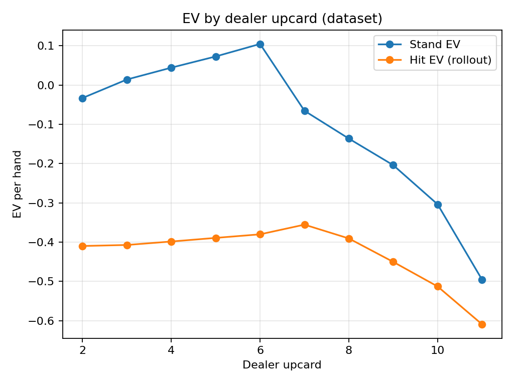
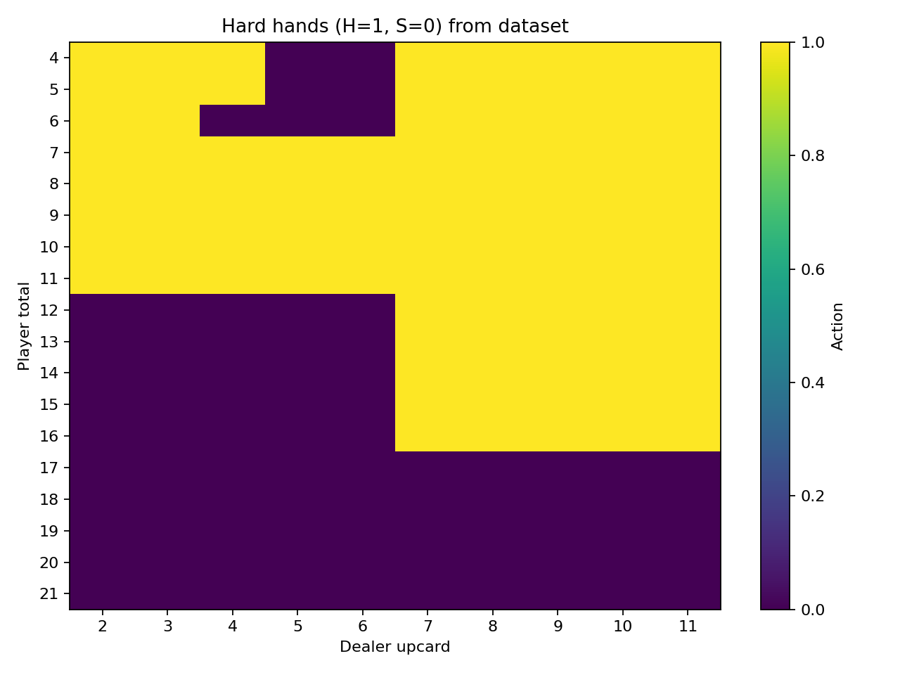
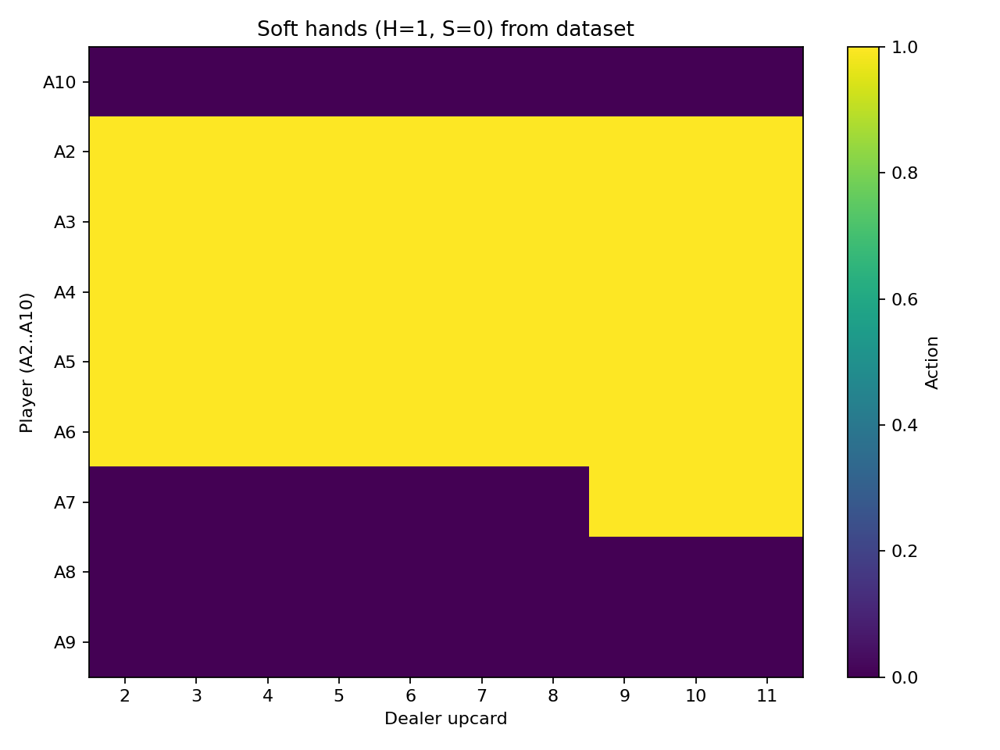
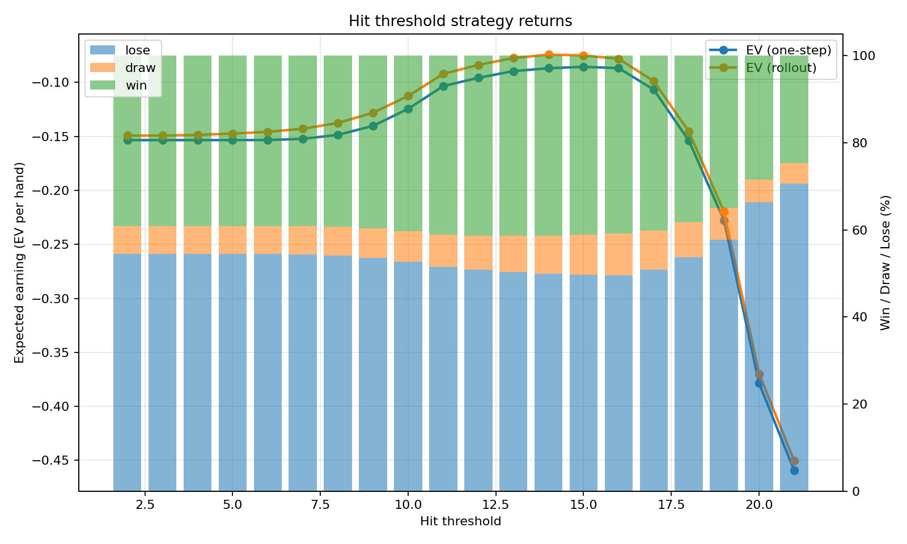
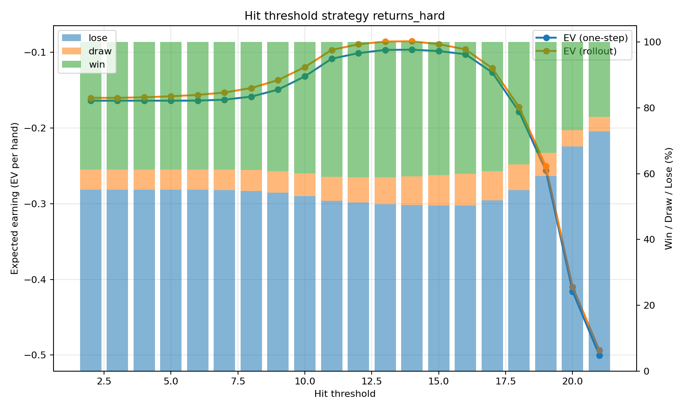
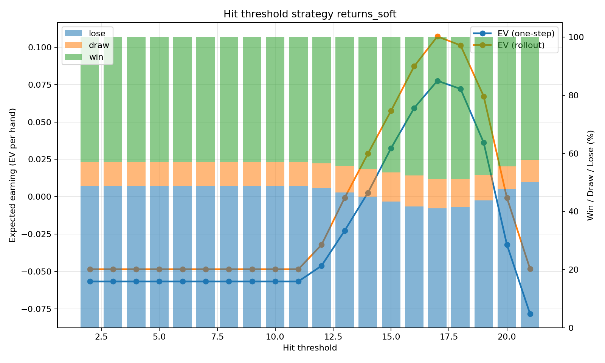
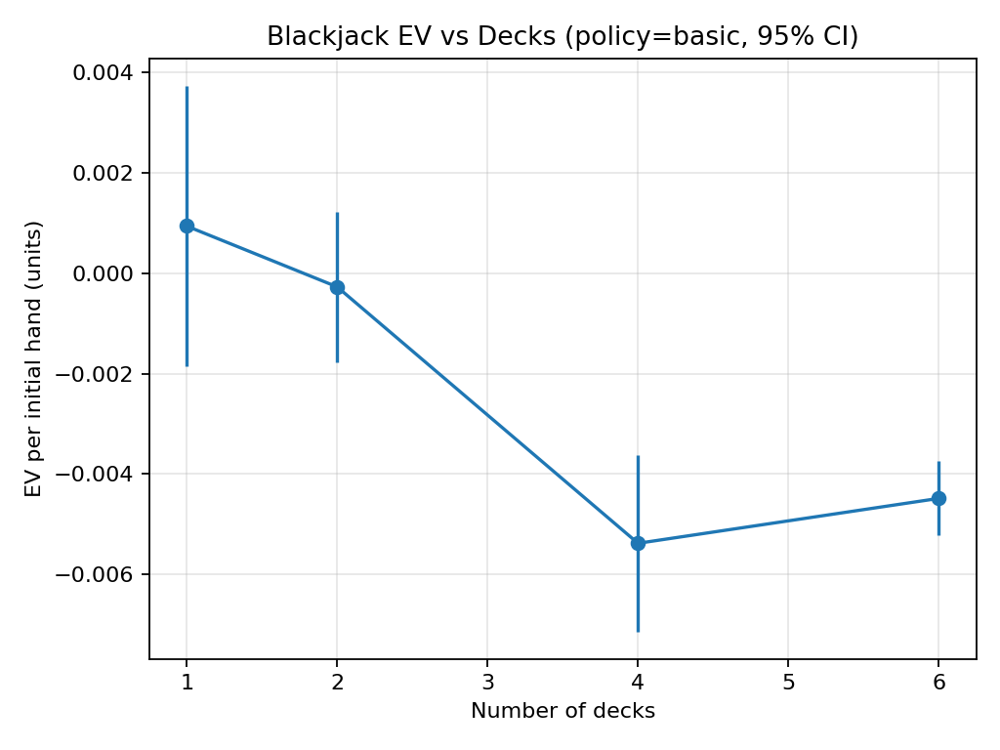

# Blackjack Pipeline (Dataset → Analysis → Simulation)

A single-file toolkit for studying Blackjack via Monte Carlo methods. It generates state-level datasets, analyzes EVs and policies, and simulates full rounds using either a **Naive** policy or a full **Basic Strategy** (pairs/soft/hard with splits and doubles).

> **File:** `blackjack_pipeline.py`  
> **Subcommands:** `dataset`, `analyze`, `simulate`

---

## ✨ Features

- **Dataset generator** (infinite-deck draws) with **rollout EVs** for `Hit` vs `Stand` at each decision state.
- **Analysis** that computes summary metrics, EV by dealer upcard, and **heatmaps** for hard/soft hands.
- **Full-game Monte Carlo simulator** with configurable rules and **Basic Strategy** (including splits/doubles) or a simple **Naive** policy.
- Multiprocessing for faster sims; reproducible via seeds.

---

## 📦 Setup

1. **Python 3.9+** recommended.
2. Install requirements (standard library + NumPy, Pandas, Matplotlib):
   ```bash
   pip install numpy pandas matplotlib
   ```
3. Keep the project lightweight—everything runs from the single script: `blackjack_pipeline.py`.

> Tip: Run from the project root so relative paths (like `data/` and `outputs/`) resolve cleanly.

---

## 🚀 Quick Start

### 1) Generate a dataset
Creates a CSV of decision states (*not* full rounds), including rollout EVs.

```bash
python blackjack_pipeline.py dataset \
  --rows 100000 \
  --seed 42 \
  --out data/blackjack_games.csv
# Add --s17 if the dealer should Stand on Soft 17 (default is H17)
```

**Output (placeholder):**
- `data/blackjack_games.csv` ✅ *(to be generated)*

---

### 2) Analyze the dataset
Reads the CSV and produces metrics, plots, and threshold analyses.

```bash
python blackjack_pipeline.py analyze \
  --csv data/blackjack_games.csv \
  --outdir outputs
```

**Outputs (placeholders):**
- `outputs/analysis_summary.csv` ✅ *(metrics; EVs and W/D/L rates)*
- `outputs/ev_by_upcard.png`  *(to be generated)*
- `outputs/hard_heatmap.png`  *(to be generated)*
- `outputs/soft_heatmap.png`  *(to be generated)*
- `outputs/threshold_summary.csv` ✅ *(overall threshold)*
- `outputs/threshold_plot.png`  *(to be generated)*
- `outputs/threshold_summary_hard.csv` ✅
- `outputs/threshold_plot_hard.png` 
- `outputs/threshold_summary_soft.csv` ✅
- `outputs/threshold_plot_soft.png` 

> The threshold plots show stacked Win/Draw/Lose bars with EV curves for one-step and (if present) rollout EVs.  
> Heatmaps visualize the **majority action** (Hit=1, Stand=0) across player totals vs dealer upcard, split into **hard** and **soft** hands.

---

### 3) Simulate full rounds
Runs a full Blackjack game loop across multiple decks with either **basic** or **naive** policy, averaging across replicates and exporting EV summaries and a CI plot.

```bash
python blackjack_pipeline.py simulate \
  --policy basic \
  --decks 1 2 4 6 \
  --n-games 200000 \
  --replicates 5 \
  --outdir outputs
# Optional rule toggles:
#   --s17                   (Dealer Stands on Soft 17; default is H17)
#   --bj-payout 1.5         (Blackjack payout; default 1.5 = 3:2)
#   --no-das                (Disable Double After Split; default allows DAS)
#   --max-splits 3          (Max splits; default 3 -> up to 4 hands)
#   --hit-split-aces        (Allow hitting split aces; usually false)
#   --double-9-to-11-only   (Restrict doubles to hard 9–11)
#   --workers auto          (Use CPU cores - 1; or pass an integer)
```

**Outputs (placeholders):**
- `outputs/ev_vs_decks_summary.csv` ✅ *(mean EV and W/D/L% per deck count)*
- `outputs/ev_vs_decks.png`  *(to be generated)*

> The CI chart shows **mean EV per initial hand** with **95% confidence intervals** across deck counts.

---

## 🧰 Command Reference

### `dataset`
Generate decision-state rows (player vs dealer upcard). Uses infinite-deck draws; excludes natural blackjacks (no decision to make).

**Arguments**
- `--rows INT` (default `100000`) — number of rows to generate.
- `--seed INT` (default `42`) — RNG seed.
- `--s17` — if set, dealer **Stands** on soft 17 (default behavior is **H17**).
- `--out PATH` (default `blackjack_games.csv`) — output CSV file.

---

### `analyze`
Compute per-action EVs, win/draw/lose rates, EV-by-upcard, and threshold analyses. Generates PNGs + CSVs under `--outdir`.

**Arguments**
- `--csv PATH` (required) — dataset CSV from the `dataset` step.
- `--outdir DIR` (default `outputs`) — directory for results.

---

### `simulate`
Simulate full rounds with either **basic** or **naive** policy across deck counts and replicates. Exports summary CSV + EV vs decks plot.

**Arguments**
- `--policy {basic,naive}` (default `basic`)
- `--decks INT...` (default `1 2 4 6`)
- `--n-games INT` (default `200000`)
- `--replicates INT` (default `5`)
- `--seed INT` (default `1234`)
- `--s17` — dealer stands on soft 17 (default is H17)
- `--bj-payout FLOAT` (default `1.5`) — e.g., 3:2
- `--no-das` — disable double after split (DAS)
- `--max-splits INT` (default `3`)
- `--hit-split-aces` — allow hitting split aces (typically not allowed)
- `--double-9-to-11-only` — limit doubles to hard 9–11
- `--workers {auto|INT}` (default `auto`)
- `--outdir DIR` (default `outputs`)

---

## 📁 Expected Project Structure

```
.
├─ blackjack_pipeline.py
├─ data/
│  └─ blackjack_games.csv          # (placeholder; created by dataset step)
└─ outputs/
   ├─ analysis_summary.csv         # (placeholder)
   ├─ ev_by_upcard.png             # (placeholder)
   ├─ hard_heatmap.png             # (placeholder)
   ├─ soft_heatmap.png             # (placeholder)
   ├─ threshold_summary*.csv       # (placeholder)
   ├─ threshold_plot*.png          # (placeholder)
   ├─ ev_vs_decks_summary.csv      # (placeholder)
   └─ ev_vs_decks.png              # (placeholder)
```

---

## 🔍 Notes & Interpretation

- **EV sign convention:** Positive EV means the player gains units per initial hand; negative EV means losses.
- **Rollout EVs**: For the dataset, `ev_hit_rollout` continues with a naive policy after taking one `Hit` to estimate longer-horizon value.
- **Heatmaps**: Values are majority actions (H=1, S=0) aggregated across identical `(player_total, dealer_upcard)` states.
- **Replicates**: Using >1 replicate reduces variance and enables 95% CI bands in `simulate` outputs.

---

## 🧪 Reproducibility

- All commands accept a `--seed`. For `simulate`, the script offsets seeds per job to avoid identical streams.
- Use the same Python version and dependencies for consistent results.

---

## 🛠 Troubleshooting

- **No images generated?** Ensure `matplotlib` is installed and that `--outdir` exists or can be created.
- **CSV missing expected columns?** Make sure you ran `dataset` with the current script; older CSVs may lack rollout EVs.
- **Slow simulations?** Lower `--n-games`, reduce `--replicates`, or set `--workers` to a fixed smaller integer.

---

## 📚 Acknowledgments / References (optional)

- Standard references on Blackjack basic strategy and EV analysis (insert your chosen sources here).
- Monte Carlo methodology in gaming/simulation contexts (insert citations).

---

## ✅ Checklist (placeholders to update after runs)

- [ ] Generated `data/blackjack_games.csv` with `--rows` = ________ (date: ________)
- [ ] Ran `analyze` and verified:
  - [ ] `analysis_summary.csv` shows EV(stand)=____, EV(hit one-step)=____, EV(hit rollout)=____
  - [ ] `hard_heatmap.png` and `soft_heatmap.png` render without issues
  - [ ] Threshold plots saved (`threshold_plot*.png`)
- [ ] Ran `simulate` with `--policy basic` and decks `_____`:
  - [ ] `ev_vs_decks_summary.csv` mean EVs look reasonable
  - [ ] `ev_vs_decks.png` CI bands generated

---

## 🏷 License

Add your license here (e.g., MIT).

